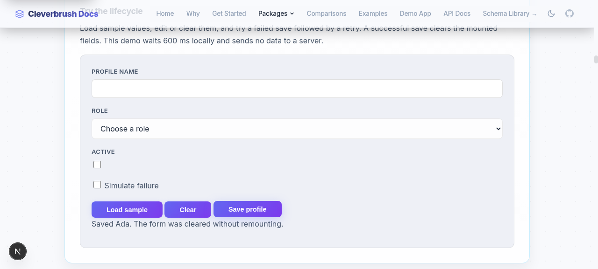

# Cache keys and schema-form lifecycle

These changes are application-agnostic. Libraries do not choose an application's
auth scope, UI kit, notifications, navigation behavior, or cache backend.

## Cache key migration (breaking)

Previously, selected values were converted to strings and joined with delimiters.
Numeric `42` and string `"42"` could share `record:id=42`; server-side date keys
could collapse different times on the same day. The server helper, client helper,
and response middleware did not agree on date precision.

All computed keys now use one browser-safe encoder exported as `computeCacheKey`
from `@cleverbrush/server/contract` (also from the server entry point) and as
`computeCacheTagKey` from `@cleverbrush/client/cache`:

```ts
import { computeCacheKey } from '@cleverbrush/server/contract';

const tag = {
    name: 'record',
    properties: {
        id: { getValue: (root: { params: { id?: unknown } }) => ({
            success: true, value: root.params.id
        }) }
    }
};
const root = { params: { id: 42 }, query: {}, headers: {}, body: undefined };
computeCacheKey(tag, root);
// ct2:["record",[["id",["number","42"]]]]
computeCacheKey({ name: 'records', properties: {} }, root);
// ct2:["records",[]] — NOT the literal base label "records"
```

- Property names and plain-object keys are sorted by code units. Types are tagged;
  delimiters are escaped by JSON. Arrays preserve order; dates preserve milliseconds.
  Bigints, non-finite numbers and negative zero remain distinguishable.
- Failed accessors and top-level `undefined` selections are omitted, as before.
  Nested `undefined` and `null` are distinct. Array holes encode as `undefined`.
- Cycles, invalid dates, functions, symbols, accessor properties, maps, sets, class
  instances and named array properties throw `TypeError`; select plain data instead.
- Treat helper output as opaque. Do not parse or hand-build computed keys.

Upgrade **every writer and invalidator sharing an external cache together**. Flush
old entries (or let them expire before enabling upgraded readers). There is no
legacy-format fallback. `externalCacheTags` sends the literal base label **and**
the new computed key by default; `invalidateBaseTags: false` sends computed keys
only, including for property-free tags. Ensure the backend supports their length
and characters; adapters can apply the same hash on both sides.

In-memory response caches retain TTL configuration and tag-name-prefix invalidation
coverage, using metadata instead of encoded-key prefixes. A successful 2xx mutation
advances tag generations; a read started before it cannot refill any alias afterward.
Failed HTTP responses or thrown mutations do not invalidate. A multi-tag cached
response becomes unusable if any of its tags changes. External writers need their
own concurrency controls; invalidation callbacks alone cannot prevent stale refills.

**Scope remains the consumer's responsibility.** Use distinct names for distinct
response shapes (`records-list` versus `record-detail`) and select every value that
changes the response. Keys do not automatically include URL, principal, tenant,
locale or headers. Keep authenticated caches request/session-scoped unless every
isolation dimension is encoded. Sharing a base invalidation label does not make
different response shapes interchangeable.

## Form values and reset

Previously edit forms could require remount keys or manual field setters to display
new values. Now mounted fields read the same values as the form:

```tsx
const form = useSchemaForm(ProfileSchema);
const city = form.useField(t => t.address.city);
useEffect(() => {
    form.reset(profile); // mounted fields update; new clean baseline
}, [form, profile]); // controller identity stays stable

form.setValue({ address: { city: 'Berlin' } }); // shallow merge; city becomes dirty
city.setValue('Paris'); // central values and parent fields update too
form.reset(); // clears values, NOT restoration of the previous baseline
```

`reset(values)` clones plain input data into the new `initialValue` baseline. It
clears errors, touched/dirty/validating flags and submission error. Returning to the
baseline clears dirty, including arrays and nested values. Setters do not mark
fields touched. `createMissingStructure: false` rejects writes to absent parents;
the field no longer displays a value that was not saved. Treat snapshots returned
by `getValue()`/fields as read-only and use setters. Keep the schema fixed for the
form's lifetime (normally define it outside render).

Validation is discarded immediately when values change, even if the next validation
is still debounced. Reset/unmount cancels scheduled validation and ignores stale
async results. Stable `useSyncExternalStore` snapshots support SSR and Strict Mode.

## Submission lifecycle

The local documentation demo shows a successful save clearing mounted fields:



Previously each form repeated validation, pending state, duplicate-submit guards,
error conversion and success handling. The new API supplies these mechanics:

```tsx
const form = useSchemaForm(ProfileSchema);
const submit = form.handleSubmit(
    async values => {
        const response = await saveProfile(values);
        if (!response.ok) return { ok: false, error: 'Could not save profile' };
        return { ok: true, data: response.data }; // success data inferred
    },
    {
        onSuccess: profile => {
            showConfirmation('Saved'); // notifications/navigation remain app-owned
            closeDialog();
        },
        onError: error => {
            if (isExpectedNetworkError(error)) return 'Please try again';
            throw error; // preserve unexpected/control-flow exceptions
        }
    }
);
return <form onSubmit={submit}>
    {/* fields */}
    {form.error && <p role="alert">{form.error}</p>}
    <button disabled={form.submitting}>
        {form.submitting ? 'Saving…' : 'Save'}
    </button>
</form>;
```

`onValid` accepts synchronous/async `void` (success), `{ ok: true, data? }`, or
`{ ok: false, error: string }`. `onError` is optional: without it exceptions reject
the handler promise; returning a string translates an exception to `form.error`,
and rethrowing preserves it. Exceptions from `onSuccess` always propagate and are
not misreported as failed writes. The awaitable handler calls `preventDefault` and
locks duplicates from validation through success/error handling. Failures retain
inputs; the next attempt clears submission error. `submitting` and `error` are
reactive, read-only flags. `submit()`/`validate()` still return `ValidationResult`.

Reset/unmount suppress callbacks/results from older submissions, but do not cancel
network operations. Reset keeps the submission lock until that operation settles.
A value change during async validation prevents dispatch of stale validated values.

## Typed renderers without a UI dependency

Legacy `Field`, `FieldRenderer`, `FormSystemProvider` and nested providers remain
supported. For new code, capture renderer types once instead of casting custom props:

```tsx
import { createFormSystem, defineFieldRenderer, useSchemaForm } from '@cleverbrush/react-form';
import { object, string } from '@cleverbrush/schema';

const text = defineFieldRenderer<string, { placeholder?: string }>(props => (
    <input value={props.value ?? ''} placeholder={props.fieldProps?.placeholder}
        onChange={e => props.onChange(e.target.value)} onBlur={props.onBlur} />
));
const select = defineFieldRenderer<string, { options: string[] }>(props => (
    <select value={props.value ?? ''} onChange={e => props.onChange(e.target.value)}>
        {props.fieldProps?.options.map(value => <option key={value}>{value}</option>)}
    </select>
));
const basic = createFormSystem({ renderers: { string: text } });
const ui = createFormSystem({ renderers: {
    ...basic.renderers, 'string:select': select
} });
const ProfileSchema = object({ name: string(), role: string() });
function ProfileForm() {
    const form = useSchemaForm(ProfileSchema);
    return <ui.Field form={form} forProperty={t => t.role} variant="select"
        fieldProps={{ options: ['reader', 'editor'] }} />;
    // Unknown variant, missing options, or numeric options: compile-time errors.
}
```

The factory returns `Field`, `Provider`, and a composable `renderers` registry.
Typed fields use their factory's registry without needing a provider; an untyped
ancestor cannot replace a renderer with incompatible props. `ui.Provider` also
configures legacy descendants and supports normal nesting. Required custom props
make `fieldProps` required at the call site.

Use `boolean` for checkboxes, `string[]` for multi-selects, `number | undefined`
for numeric inputs that can be cleared, and `string | null` for nullable strings.
Values can initially be `undefined`; optional/nested fields retain their types.
No UI-kit dependency or application-specific field vocabulary is introduced.
